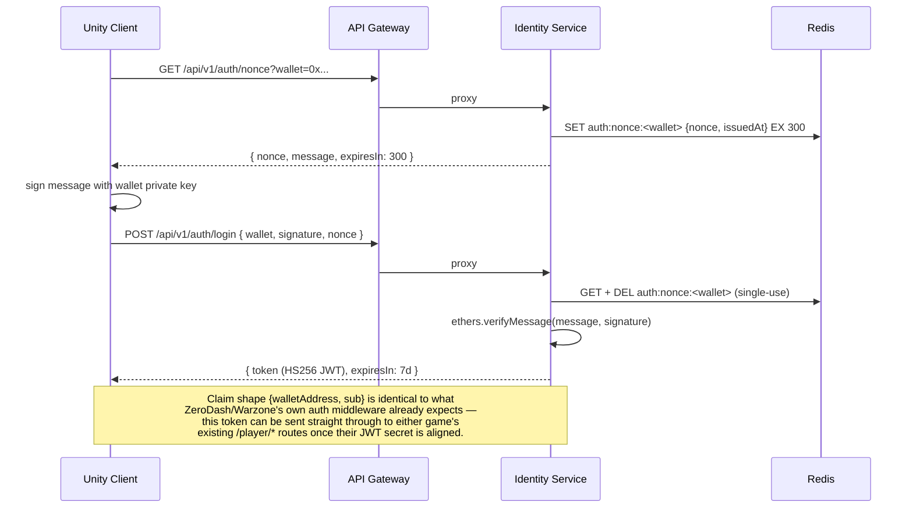
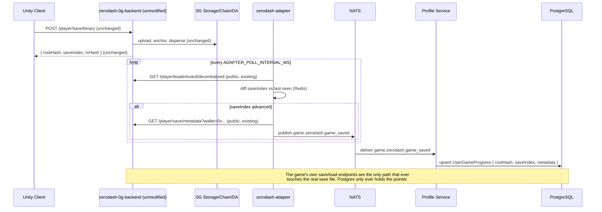
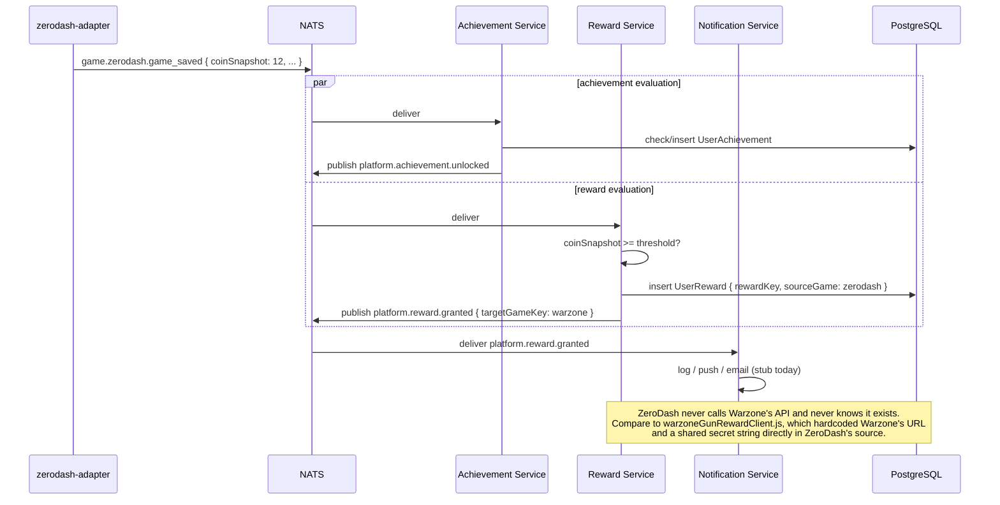

# Service Communication

**Read [00-platform-vision.md](./00-platform-vision.md) first.** Flow 2 below is the *transitional* path ZeroDash/Warzone use today; flow 2b is the platform-owned save pipeline that's the actual target for every game, including those two once migrated (see [08-migration-roadmap.md](./08-migration-roadmap.md)). All sequence diagrams are Mermaid — view in any Markdown renderer that supports it (GitHub, VS Code preview, etc.).

## 1. Login (single identity across every game)



## 2. Save flow — TRANSITIONAL bridge (where ZeroDash/Warzone are today; not the target architecture)



## 2b. Save flow — THE TARGET (platform owns the entire pipeline; live-verified, used by no real game yet)

```mermaid
sequenceDiagram
    participant Unity as Unity Client
    participant GW as API Gateway
    participant Save as Save Service
    participant Redis
    participant ZG as 0G Storage (or local-disk driver)
    participant PG as PostgreSQL
    participant NATS
    participant Verify as Verification Service

    Unity->>GW: POST /api/v1/save/<gameKey> { ...plain JSON... } (Bearer JWT)
    GW->>Save: proxy
    Save->>Save: validate against per-game Zod schema; wallet from JWT, never body
    Save->>NATS: publish game.<gameKey>.save_requested
    Save->>Redis: SET cache:save:<gameKey>:<wallet> (fast working copy — not the source of truth)
    Save->>Save: msgpack-encode, gzip-compress
    Save->>ZG: upload(buffer) -> rootHash
    Save->>PG: upsert UserGameProgress { rootHash, saveIndex, metadata } (pointer only, never the JSON)
    Save->>NATS: publish game.<gameKey>.save_completed AND game.<gameKey>.game_saved (same payload)
    Save-->>Unity: { rootHash, saveIndex }

    NATS->>Verify: deliver save_completed
    Verify->>Verify: coinDelta/saveIndexDelta check (threshold from GameMetadata)
    Verify->>ZG: (if 0G Compute configured) anti-cheat call; else skip gracefully
    Verify->>PG: merge computeStatus/verdict into UserGameProgress.metadata
    Verify->>NATS: publish game.<gameKey>.save_validated

    Note over Unity,PG: Verified live: deleting the Redis key and re-loading still returns<br/>the exact original JSON, recovered from the storage driver — proof<br/>0G Storage, not Redis, is the real source of truth.
```

Load is the mirror: `GET /api/v1/save/<gameKey>` checks Redis first, falls back to Postgres → 0G Storage → decode → repopulate Redis on a cache miss.

## 3. Cross-game reward fan-out (replaces the warzoneGunRewardClient.js hack)


