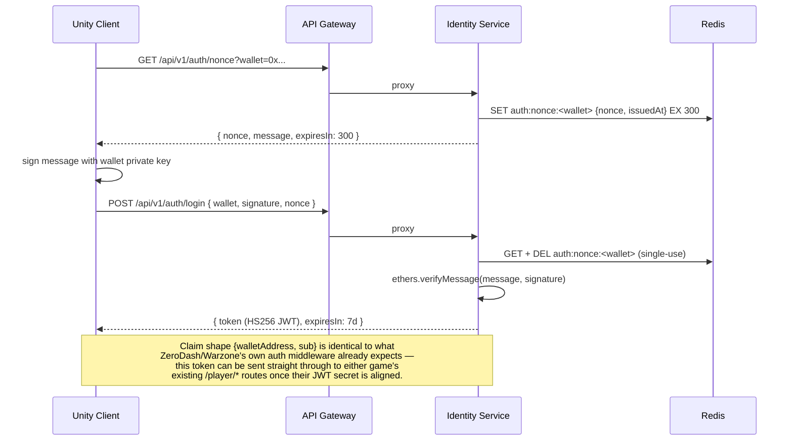
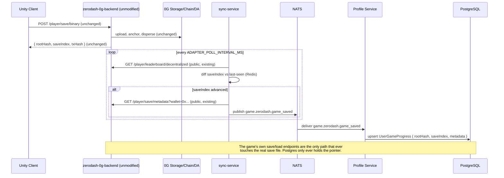
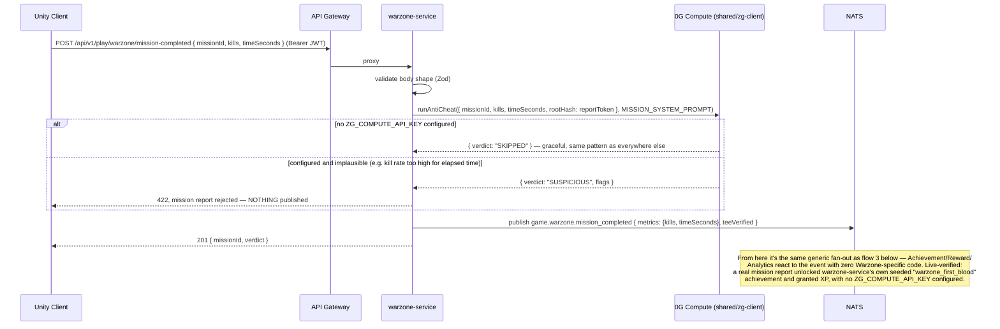
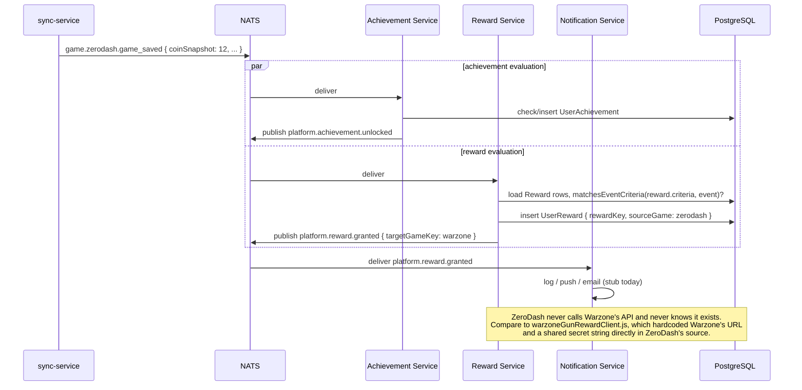

# Service Communication

**Read [00-platform-vision.md](./00-platform-vision.md) first.** Flow 2 below is the *transitional* path ZeroDash/Warzone use today; flows 2b and 2c are the platform-owned pipeline that's the actual target for every game, including those two once migrated (see [08-migration-roadmap.md](./08-migration-roadmap.md)) — both are live-verified reference implementations (`warzone-service`/`zerodash-service`), not specified-but-unbuilt designs. All sequence diagrams are Mermaid — view in any Markdown renderer that supports it (GitHub, VS Code preview, etc.).

## 1. Login (single identity across every game)



## 2. Save flow — TRANSITIONAL bridge (where ZeroDash/Warzone are today; not the target architecture)



## 2b. Save flow — THE TARGET (platform owns the entire pipeline; live-verified reference implementation, not yet used by either real game's Unity client)

**Round 4 changed this flow's shape**: Unity talks to that game's own per-game service (`warzone-service`/`zerodash-service`), never to `save-service` directly — and `save-service` itself no longer validates against any game's schema at all (that moved upstream). The gateway path is `/api/v1/play/<gameKey>`, deliberately distinct from `/api/v1/games/<gameKey>` (the legacy passthrough to the real, unmodified existing backend — see flow 2).

```mermaid
sequenceDiagram
    participant Unity as Unity Client
    participant GW as API Gateway
    participant Game as warzone-service / zerodash-service
    participant Save as Save Service
    participant Redis
    participant ZG as 0G Storage (or local-disk driver)
    participant PG as PostgreSQL
    participant NATS
    participant Verify as Verification Service

    Unity->>GW: POST /api/v1/play/<gameKey>/save { ...plain JSON, this game's real shape... } (Bearer JWT)
    GW->>Game: proxy
    Game->>Game: validate against THIS game's own Zod schema (services/games/<game>-service/src/save-schema.ts)
    Game->>Save: POST /save/<gameKey> { data: validatedPayload, coinSnapshot } (forwards Authorization header)
    Save->>Save: wallet from JWT, never body; saveIndex always server-computed
    Save->>NATS: publish game.<gameKey>.save_requested
    Save->>Redis: SET cache:save:<gameKey>:<wallet> (fast working copy — not the source of truth)
    Save->>Save: msgpack-encode, gzip-compress
    Save->>ZG: upload(buffer) -> rootHash
    Save->>PG: upsert UserGameProgress { rootHash, saveIndex, metadata } (pointer only, never the JSON)
    Save->>NATS: publish game.<gameKey>.save_completed AND game.<gameKey>.game_saved (same payload)
    Save-->>Game: { rootHash, saveIndex, computeStatus }
    Game-->>Unity: relay the same response

    NATS->>Verify: deliver save_completed
    Verify->>Verify: skip if computeStatus already set (synchronously gated, see flow 2c) — else: coinDelta/saveIndexDelta check (threshold from GameMetadata)
    Verify->>ZG: (if 0G Compute configured) anti-cheat call; else skip gracefully
    Verify->>PG: merge computeStatus/verdict into UserGameProgress.metadata (merge, never replace — see 09-security-model.md)
    Verify->>NATS: publish game.<gameKey>.save_validated

    Note over Unity,PG: Verified live: deleting the Redis key and re-loading still returns<br/>the exact original JSON, recovered from the storage driver — proof<br/>0G Storage, not Redis, is the real source of truth. Also verified live:<br/>a malformed payload is rejected by warzone-service's schema (400)<br/>before it ever reaches Save Service.
```

Load is the mirror: `GET /api/v1/play/<gameKey>/save` → per-game service → Save Service checks Redis first, falls back to Postgres → 0G Storage → decode → repopulate Redis on a cache miss.

## 2c. Gameplay event with a synchronous TEE gate — mission completion (live-verified)

For "important" events (mission completion, ranked results, tournament/NFT rewards, leaderboard submissions — see `09-security-model.md`), the per-game service can reject the request *before* anything is published, instead of only flagging it after the fact:



## 3. Cross-game reward fan-out (replaces the warzoneGunRewardClient.js hack)


