# Database Diagram

See [00-platform-vision.md](./00-platform-vision.md) for why this schema is shaped the way it is (platform owns progression/pointer data; 0G Storage owns save content). ER diagram for the shared Prisma schema (`shared/db/prisma/schema.prisma`). One Postgres instance for v1 — see [08-migration-roadmap.md](./08-migration-roadmap.md) for the documented split path.

## Ground rule (Round 2, applies to every table below)

**0G Storage is the single source of truth for actual player save content, always binary-encoded.** Nothing in this schema — not `UserGameProgress`, not any table added in Round 2 — ever stores game save content (campaign progress, inventory, a full resource snapshot, etc.). Every table here is one of three things: a *pointer* (`UserGameProgress.rootHash`), a *platform-computed record about a user* (an achievement unlocked, a battle-pass tier — the platform's own derived data, never a mirror of a save file), or *config/transaction data that was never "the save" in the first place* (`GameMetadata`, `IapPurchase`). `save-service` (see [02-service-communication.md](./02-service-communication.md)) writes the raw JSON to Redis only as a fast, disposable working copy — flushing Redis loses nothing, because every save is always re-fetchable from 0G Storage via the rootHash Postgres holds.

```mermaid
erDiagram
    User ||--o{ UserGameProgress : has
    User ||--o{ GameSession : has
    User ||--o{ UserAchievement : has
    User ||--o{ LeaderboardSnapshot : has
    User ||--o{ UserReward : has

    Game ||--o{ UserGameProgress : tracks
    Game ||--o{ GameSession : tracks
    Game ||--o{ Achievement : "scopes (nullable)"
    Game ||--o{ LeaderboardSnapshot : "scopes (nullable)"
    Game ||--o{ UserReward : "source (nullable)"

    Achievement ||--o{ UserAchievement : "unlocked by"
    Reward ||--o{ UserReward : "granted as"
    Game ||--o{ GameMetadata : configures
    User ||--o{ BattlePassProgress : has
    Game ||--o{ BattlePassProgress : "scopes (nullable = platform-wide)"
    User ||--o{ IapPurchase : made
    Game ||--o{ IapPurchase : "for"
    User ||--o{ SecurityAuditLog : "logged for (nullable)"

    User {
        uuid id PK
        string walletAddress
        string displayName
        int xpTotal
        int level
        datetime createdAt
    }

    Game {
        uuid id PK
        string key
        string name
        enum integrationMode
        string backendBaseUrl
        enum status
    }

    UserGameProgress {
        uuid id PK
        uuid userId FK
        uuid gameId FK
        string rootHash "0G Storage pointer, NOT the save file"
        int saveIndex
        datetime lastSaveTime
        json metadata "daStatus, computeStatus, checksum, coinSnapshot"
    }

    GameSession {
        uuid id PK
        uuid userId FK
        uuid gameId FK
        datetime startedAt
        datetime endedAt
        json metrics
    }

    Achievement {
        uuid id PK
        uuid gameId FK "nullable = platform-wide"
        string key
        string name
        json criteria
    }

    UserAchievement {
        uuid id PK
        uuid userId FK
        uuid achievementId FK
        datetime unlockedAt
    }

    LeaderboardSnapshot {
        uuid id PK
        uuid gameId FK "nullable = global"
        uuid userId FK
        string metric
        bigint score
        datetime capturedAt
    }

    Reward {
        uuid id PK
        string key
        string type
        json payload
    }

    UserReward {
        uuid id PK
        uuid userId FK
        uuid rewardId FK
        uuid sourceGameId FK "nullable"
        enum status
        datetime grantedAt
    }

    RawEvent {
        uuid id PK
        string eventType
        uuid gameId "nullable, no FK by design"
        uuid userId "nullable, no FK by design"
        json payload
        datetime occurredAt
    }

    GameMetadata {
        uuid id PK
        uuid gameId FK
        string key "e.g. anti_cheat_coin_delta_threshold"
        json value
    }

    BattlePassProgress {
        uuid id PK
        uuid userId FK
        uuid gameId FK "nullable = platform-wide pass"
        string seasonKey
        int tier
        int xp
        datetime updatedAt
    }

    IapPurchase {
        uuid id PK
        uuid userId FK
        uuid gameId FK
        string orderId
        string orderHash
        string txHash
        string category
        string product
        decimal price
        boolean delivered
        json metadata
        datetime createdAt
    }

    SecurityAuditLog {
        uuid id PK
        uuid userId FK "nullable"
        uuid gameId FK "nullable"
        string eventType
        json detail
        datetime createdAt
    }
```

## Why `UserGameProgress` instead of `warzoneRootHash` / `zeroDashRootHash` columns

A per-game column on `User` doesn't scale past a handful of games and forces a schema migration every time a game is added. `UserGameProgress` is a normal join table keyed on `(userId, gameId)` — adding game #101 is one row in `Game`, zero schema changes. `rootHash` lives in the `metadata`-adjacent column here purely as a *pointer*; the byte-for-byte save data never leaves 0G Storage and the platform database never stores it.

## `RawEvent` has no foreign keys on purpose

`gameId`/`userId` are plain strings, not FKs, because analytics must never fail to record an event just because the referenced game or user row doesn't exist yet (ordering races between adapters/services are expected under normal operation) — durability of the raw signal matters more here than referential integrity.

## Round 2 additions, and why each one isn't "save content in disguise"

- **`GameMetadata`** — static, per-game *configuration* an admin sets once (anti-cheat thresholds, reward thresholds). `reward-service`'s cross-game reward threshold and `verification-service`'s anti-cheat trigger threshold both read from here now instead of being hardcoded constants — a real, working example of the extension point, not a doc promise.
- **`BattlePassProgress`** — a platform-*computed* progression record (tier/xp the platform calculated from `platform.user.xp_gained` events), the same category as `UserAchievement`. `gameId: null` models the platform-wide pass — cross-game XP feeding one shared pass.
- **`IapPurchase`** — direct normalization of the supplied `IAPPurchase_forWarzone.js` Mongoose schema (wallet string → `userId` FK). A purchase *receipt*, never the save itself. Schema only this round — no event producer yet, reserved for real IAP integration.
- **`SecurityAuditLog`** — written synchronously by `identity-service` (never via NATS — auth/security logging shouldn't be eventually-consistent) on nonce-replay attempts, signature failures, and successful logins.

**Dropped during design, not shipped:** an earlier draft of this round considered a generic `PlayerStatistic(key, value Json)` table to generalize ZeroDash's `coins`/`characters` and Warzone's `PlayerResources`/`PlayerRambos`/etc. directly into Postgres. That would have made Postgres a second, competing source of truth for save content — exactly the thing the ground rule above forbids. `UserGameProgress.metadata` already covers the legitimate need (a handful of denormalized scalars like `coinSnapshot` for leaderboard/achievement queries) without ever holding the full save.
